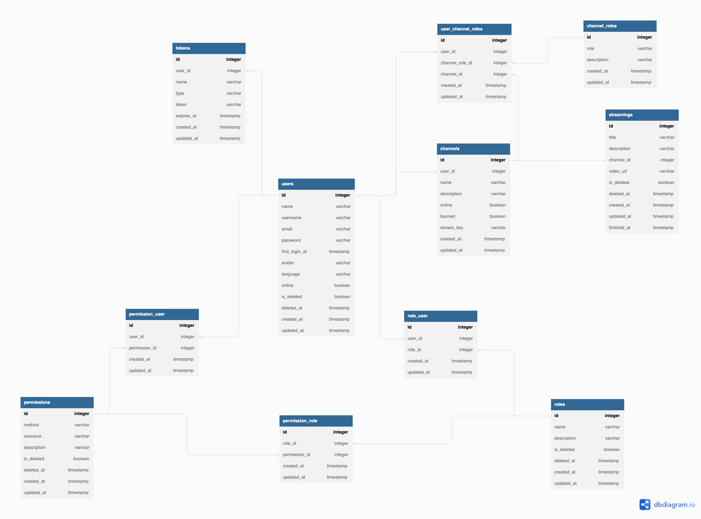

<p align="center">
  <a href="https://www.typescriptlang.org/" target="blank"></a>
</p>

<p align="center">
  Server-side app providing live streaming video platform implementing RBAC
</p>

<p align="center">
  
  
  
  
  
  
</p>

## Table of contents

- [Database modeling](#database-modeling)
- [Use Cases](#use-cases)
- [Technologies](#technologies)
- [Setup](#setup)
- [Installation](#installation)
- [See the magic](#see-the-magic-star)
- [Automated Tests](#automated-tests)

## Database modeling

<p align="center">
  
</p>

## Use Cases

- Users can create an account;
- Users can recover their password;
- Users can see all the other users availables;
- Users can check their own profiles;
- Users can create, edit and check their channels;
- Users can check other online channels;
- Users can start a stream to the server :star: :rocket:

## Technologies

- Typescript
- Node.js
- AdonisJS
- PostgreSQL
- Docker / Docker Compose

# Setup

```
$ docker-compose up -d
$ cp .env.example .env
```

###### Obs: env variables available on # Mail section needs to be filled by you if you want to test mail send

###### Obs: All endpoints are available in insomnia_apis.json file in root folder. Use insomnia software to test it

## Installation

```bash
$ npm install
or
$ yarn
```

## See the magic :star:

#### Using OBS

##### With OBS open, go to settings -> transmission and set in the server field the following:

```
rtmp://localhost/live
```

##### In the stream key insert first your username created in platform

```
YOUR_USERNAME?key=YOUR_STREAM_KEY
```

##### Get your stream key by accessing this following API:

```
GET - channels/:id/stream_key
```

##### After this just click on start streaming and it is going to start!

&emsp;

#### Watching the stream

##### To watch your stream you can go to your browser and type following url

```
http://localhost:8000/live/YOUR_USERNAME.flv
```

###### It will download a .flv file while your stream is active

##### OR

##### You can use a software like VLC and open media by network inserting the following url

```
rtmp://localhost:1935/live/YOUR_USERNAME
```

## Automated Tests

```bash
$ npm run test
or
$ yarn test
```

## License

[MIT licensed](LICENSE).
